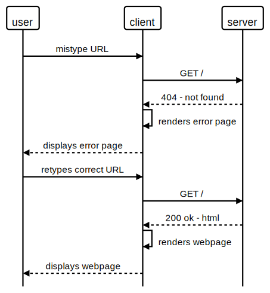
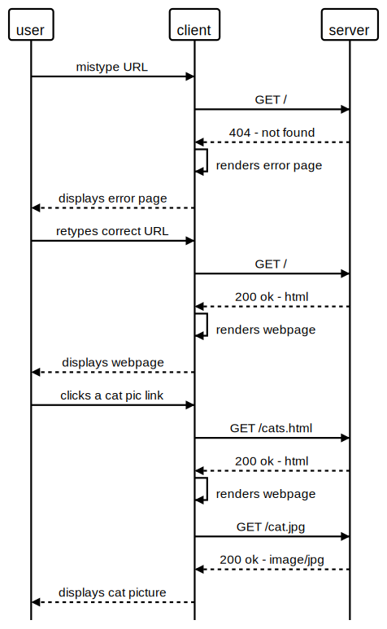
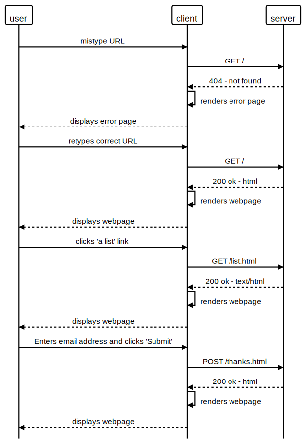

# Modelling Processes

## Model these following code snippets(processes):

### Home page with typo

A user tries to visit https://makers-cats.herokuapp.com/, but mistypes the url as https://makers-rats.herokuapp.com/ in their browser.

When they don't see the page they expect and fix their typo to the correct home page URL, they are shown this HTML:

```
<!DOCTYPE html>
<html>
  <head>
    <meta charset="utf-8">
    <title>Req/Res</title>
  </head>
  <body>
    <ul>
      <a href="list.html">a list</a>
      <a href="cats.html">a cat pic</a>
    </ul>
  </body>
</html>
```



### Cat page

A user clicks the a cat pic link and is shown this HTML:

```
<!DOCTYPE html>
<html>
  <head>
    <meta charset="utf-8">
    <title>a cat</title>
  </head>
  <body>
    
  </body>
</html>
```



### Mailing list page

A user clicks the list link and is shown this HTML:

```
<!DOCTYPE html>
<html>
  <head>
    <meta charset="utf-8">
    <title>A list</title>
  </head>
  <body>
    <form action="thanks.html" method="POST">
      <input type="text" name="email">
      <input type="submit">
    </form>
  </body>
</html>
```

The user fills in their email address and clicks the submit button.

The user is sent to the thanks.html page and is shown this HTML:

```
<!DOCTYPE html>
<html>
  <head>
    <meta charset="utf-8">
    <title>Thanks page</title>
  </head>
  <body>
    <h1>Thanks!</h1>
  </body>
</html>
```

