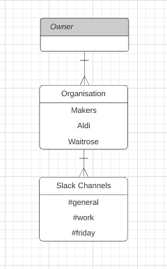
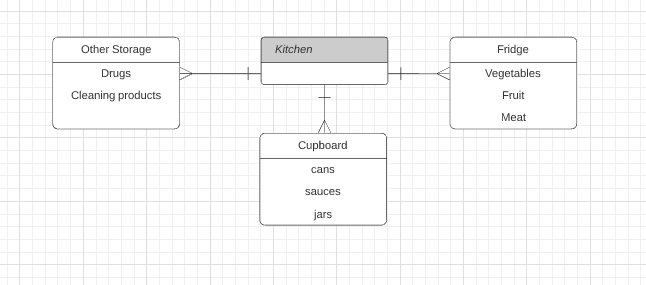
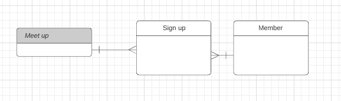
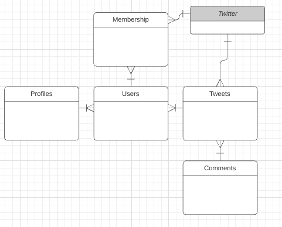

# Entity Relationship Diagrams

### Exercise 1
Diagram the following:

Slack has many organisations. Each organisation has many Slack channels. Each organisation has one owner.

Diagram:

  

### Exercise 2

Diagram the following, with as much imagination as you like:

The Kitchen:

  

### Exercise 3

Diagram the following:

Each member can go to many meet-ups. Each meet up can have many members.

  

Exercise 4

Diagram one or more of the following, with as much imagination as you like:

    Twitter (including hashtags)
    Makers Academy
    Spitalfields Market

Twitter: ( As I know I am making a twitter clone on the weekend )

  

